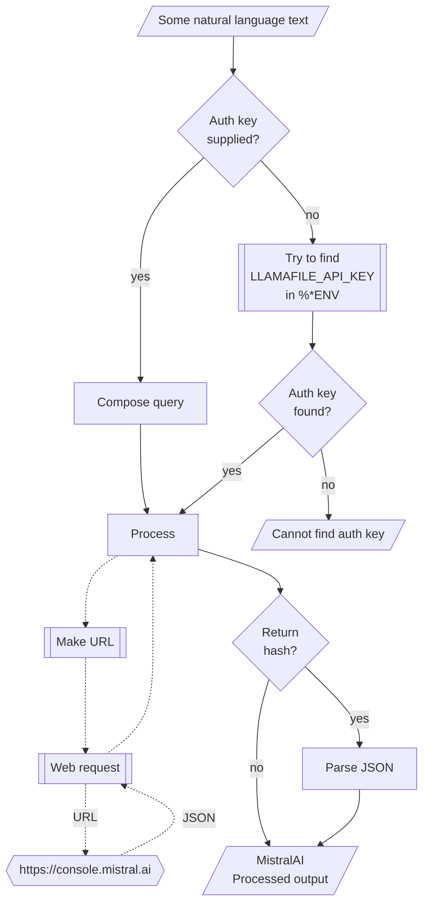

# WWW::LlamaFile

## In brief

This Raku package provides access to the machine learning service [llamafile](https://github.com/mozilla-Ocho/llamafile), [MO1].
For more details of the llamafile's API usage see [the documentation](https://github.com/mozilla-Ocho/llamafile?tab=readme-ov-file), [MO2].

This package is very similar to the packages 
["WWW::OpenAI"](https://github.com/antononcube/Raku-WWW-OpenAI), [AAp1], and 
["WWW::MistralAI"](https://github.com/antononcube/Raku-WWW-MistralAI), [AAp2]. 

"WWW::LlamaFile" can be used with (is integrated with) 
["LLM::Functions"](https://github.com/antononcube/Raku-LLM-Functions), [AAp3], and
["Jupyter::Chatbook"](https://github.com/antononcube/Raku-Jupyter-Chatbook), [AAp5].

Also, of course, prompts from 
["LLM::Prompts"](https://github.com/antononcube/Raku-LLM-Prompts), [AAp4],
can be used with MistralAI's functions.

-----

## Installation

Package installations from both sources use [zef installer](https://github.com/ugexe/zef)
(which should be bundled with the "standard" Rakudo installation file.)

To install the package from [Zef ecosystem](https://raku.land/) use the shell command:

```
zef install WWW::LlamaFile
```

To install the package from the GitHub repository use the shell command:

```
zef install https://github.com/antononcube/Raku-WWW-LlamaFile.git
```

----

## Usage examples

**Remark:** When the authorization key, `auth-key`, is specified to be `Whatever`
then it is assigned the string `sk-no-key-required`.
If an authorization key is required then the env variable `LLAMAFILE_API_KEY` can be also used.

### Universal "front-end"

The package has an universal "front-end" function `llamafile-playground` for the 
[different functionalities provided by llamafile](https://github.com/Mozilla-Ocho/llamafile/blob/main/README.md).

Here is a simple call for a "chat completion":

```perl6
use WWW::LlamaFile;
llamafile-playground('Where is Roger Rabbit?');
```

Another one using Bulgarian:

```perl6
llamafile-playground('Колко групи могат да се намерят в този облак от точки.', max-tokens => 300, random-seed => 234232, format => 'values');
```

**Remark:** The functions `llamafile-chat-completion` or `llamafile-completion` can be used instead in the examples above.
(The latter is synonym of the former.)


### Models

The current MistralAI models can be found with the function `llamafile-models`:

```perl6
*<id>.say for |llamafile-models;
```

### Code generation

There are two types of completions : text and chat. Let us illustrate the differences
of their usage by Raku code generation. Here is a text completion:

```perl6
llamafile-completion(
        'generate Raku code for making a loop over a list',
        max-tokens => 120,
        format => 'values');
```

Here is a chat completion:

```perl6
llamafile-completion(
        'generate Raku code for making a loop over a list',
        max-tokens => 120,
        format => 'values');
```


### Embeddings

Embeddings can be obtained with the function `llamafile-embeddings`. Here is an example of finding the embedding vectors
for each of the elements of an array of strings:

```perl6
my @queries = [
    'make a classifier with the method RandomForeset over the data dfTitanic',
    'show precision and accuracy',
    'plot True Positive Rate vs Positive Predictive Value',
    'what is a good meat and potatoes recipe'
];

my $embs = llamafile-embeddings(@queries, format => 'values', method => 'tiny');
$embs.elems;
```

Here we show:
- That the result is an array of four vectors each with length 1536
- The distributions of the values of each vector

```perl6
use Data::Reshapers;
use Data::Summarizers;

say "\$embs.elems : { $embs.elems }";
say "\$embs>>.elems : { $embs>>.elems }";
records-summary($embs.kv.Hash.&transpose);
```

Here we find the corresponding dot products and (cross-)tabulate them:

```perl6
use Data::Reshapers;
use Data::Summarizers;
my @ct = (^$embs.elems X ^$embs.elems).map({ %( i => $_[0], j => $_[1], dot => sum($embs[$_[0]] >>*<< $embs[$_[1]])) }).Array;

say to-pretty-table(cross-tabulate(@ct, 'i', 'j', 'dot'), field-names => (^$embs.elems)>>.Str);
````

**Remark:** Note that the fourth element (the cooking recipe request) is an outlier.
(Judging by the table with dot products.)

### Chat completions with engineered prompts

Here is a prompt for "emojification" (see the
[Wolfram Prompt Repository](https://resources.wolframcloud.com/PromptRepository/)
entry
["Emojify"](https://resources.wolframcloud.com/PromptRepository/resources/Emojify/)):

```perl6
my $preEmojify = q:to/END/;
Rewrite the following text and convert some of it into emojis.
The emojis are all related to whatever is in the text.
Keep a lot of the text, but convert key words into emojis.
Do not modify the text except to add emoji.
Respond only with the modified text, do not include any summary or explanation.
Do not respond with only emoji, most of the text should remain as normal words.
END
```

Here is an example of chat completion with emojification:

```perl6
llamafile-chat-completion([ system => $preEmojify, user => 'Python sucks, Raku rocks, and Perl is annoying'], max-tokens => 200, format => 'values')
```

-------

## Command Line Interface

### Playground access

The package provides a Command Line Interface (CLI) script:

```shell
llamafile-playground --help
```

**Remark:** When the authorization key argument "auth-key" is specified set to "Whatever"
then `llamafile-playground` attempts to use the env variable `LLAMAFILE_API_KEY`.


--------

## Mermaid diagram

The following flowchart corresponds to the steps in the package function `llamafile-playground`:



--------

## References

### Packages

[AAp1] Anton Antonov,
[WWW::OpenAI Raku package](https://github.com/antononcube/Raku-WWW-OpenAI),
(2023-2024),
[GitHub/antononcube](https://github.com/antononcube).

[AAp2] Anton Antonov,
[WWW::MistralAI Raku package](https://github.com/antononcube/Raku-WWW-MistralAI),
(2023-2024),
[GitHub/antononcube](https://github.com/antononcube).

[AAp3] Anton Antonov,
[LLM::Functions Raku package](https://github.com/antononcube/Raku-LLM-Functions),
(2023-2024),
[GitHub/antononcube](https://github.com/antononcube).

[AAp4] Anton Antonov,
[LLM::Prompts Raku package](https://github.com/antononcube/Raku-LLM-Prompts),
(2023-2024),
[GitHub/antononcube](https://github.com/antononcube).

[AAp5] Anton Antonov,
[Jupyter::Chatbook Raku package](https://github.com/antononcube/Raku-Jupyter-Chatbook),
(2023),
[GitHub/antononcube](https://github.com/antononcube).

[MO1] Mozilla Ocho, [llamafile](https://github.com/mozilla-Ocho/llamafile).

[MO2] Mozilla Ocho, [llamafile documentation](https://github.com/Mozilla-Ocho/llamafile/blob/main/README.md).
