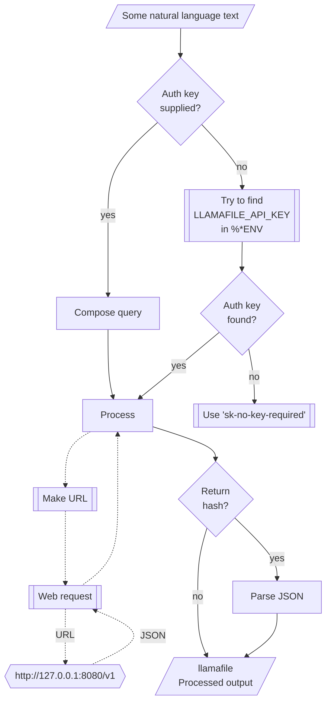

# WWW::LlamaFile

## In brief

This Raku package provides access to the machine learning service [llamafile](https://github.com/mozilla-Ocho/llamafile), [MO1].
For more details of the llamafile's API usage see [the documentation](https://github.com/mozilla-Ocho/llamafile?tab=readme-ov-file), [MO2].

This package is very similar to the packages 
["WWW::OpenAI"](https://github.com/antononcube/Raku-WWW-OpenAI), [AAp1], and 
["WWW::MistralAI"](https://github.com/antononcube/Raku-WWW-MistralAI), [AAp2]. 

"WWW::LlamaFile" can be used with (is integrated with) 
["LLM::Functions"](https://github.com/antononcube/Raku-LLM-Functions), [AAp3], and
["Jupyter::Chatbook"](https://github.com/antononcube/Raku-Jupyter-Chatbook), [AAp5].

Also, of course, prompts from 
["LLM::Prompts"](https://github.com/antononcube/Raku-LLM-Prompts), [AAp4],
can be used with MistralAI's functions.

-----

## Installation

Package installations from both sources use [zef installer](https://github.com/ugexe/zef)
(which should be bundled with the "standard" Rakudo installation file.)

To install the package from [Zef ecosystem](https://raku.land/) use the shell command:

```
zef install WWW::LlamaFile
```

To install the package from the GitHub repository use the shell command:

```
zef install https://github.com/antononcube/Raku-WWW-LlamaFile.git
```

----

## Usage examples

**Remark:** When the authorization key, `auth-key`, is specified to be `Whatever`
then it is assigned the string `sk-no-key-required`.
If an authorization key is required then the env variable `LLAMAFILE_API_KEY` can be also used.

### Universal "front-end"

The package has an universal "front-end" function `llamafile-playground` for the 
[different functionalities provided by llamafile](https://github.com/Mozilla-Ocho/llamafile/blob/main/README.md).

Here is a simple call for a "chat completion":

```perl6
use WWW::LlamaFile;
llamafile-playground('Where is Roger Rabbit?');
```
```
# [{finish_reason => stop, index => 0, message => {content => Roger Rabbit is a fictional character from the popular 1988 animated/live-action film "Who Framed Roger Rabbit." He's a cartoon rabbit with human-like features and behaviors. If you're asking where he can be found in real life, I regret, role => assistant}}]
```

Another one using Bulgarian:

```perl6
llamafile-playground('Колко групи могат да се намерят в този облак от точки.', max-tokens => 300, random-seed => 234232, format => 'values');
```
```
# За да определим броя на групите от точки в образец, ние трябва да приложим метод на кликенгъс (cluster analysis). Той е метод за групиране на данни, които се приближават помежду си повече отколкото до други данни. В случая с вашите точки, ние трябва да определим дистанцията между всяка двойка точки и след това да намерим границата на разстоянията, които дефинират една група от точките.
# 
# Въпреки че можем да използваме различни методи за кластерно анализ, един популярен метод е DBSCAN (Density-Based Spatial Clustering of Applications with Noise). Този метод изисква два параметъра - ε (eps) и минимална гъстота на точките в група.
# 
# Получаването на резултати от DBSCAN могат да варират в зависимост от избраните стойности на тези параметри, но ще можем да получим идея за броя
```

**Remark:** The functions `llamafile-chat-completion` or `llamafile-completion` can be used instead in the examples above.
(The latter is synonym of the former.)


### Models

The current MistralAI models can be found with the function `llamafile-models`:

```perl6
*<id>.say for |llamafile-models;
```
```
#ERROR: Type Str does not support associative indexing.
#ERROR: Cannot find Mistral.AI authorization key. Please provide a valid key to the argument auth-key, or set the ENV variable LLAMAFILE_API_KEY.
#ERROR: Cannot convert from JSON, returning "asis".
# Nil
```

### Code generation

There are two types of completions : text and chat. Let us illustrate the differences
of their usage by Raku code generation. Here is a text completion:

```perl6
llamafile-completion(
        'generate Raku code for making a loop over a list',
        max-tokens => 120,
        format => 'values');
```
```
# Here's a simple example of how to loop over a list in Raku:
# 
# ```raku
# my @list = (1, 2, 3, 4, 5); # Define a list
# 
# for my $item (@list) {
#     say $item; # Print each item in the list
# }
# ```
# 
# In this code snippet, we first define a list `@list` with some elements. Then, we use a `for` loop to iterate over each item in the list. The variable `$item
```

Here is a chat completion:

```perl6
llamafile-completion(
        'generate Raku code for making a loop over a list',
        max-tokens => 120,
        format => 'values');
```
```
# To loop over a list in Raku, you can use the `for` loop with the `Xs` protocol which is available for collections like lists. Here's a simple example:
# 
# ```raku
# my @numbers = (1, 2, 3, 4, 5); # This is a list of numbers.
# 
# for my $number (@numbers) {
#     say "Number: ", $number;
# }
# ```
# 
# In this example, we create a list `@numbers` containing some numbers. We
```


### Embeddings

Embeddings can be obtained with the function `llamafile-embeddings`. Here is an example of finding the embedding vectors
for each of the elements of an array of strings:

```perl6
my @queries = [
    'make a classifier with the method RandomForeset over the data dfTitanic',
    'show precision and accuracy',
    'plot True Positive Rate vs Positive Predictive Value',
    'what is a good meat and potatoes recipe'
];

my $embs = llamafile-embeddings(@queries, format => 'values', method => 'tiny');
$embs.elems;
```
```
#ERROR: Cannot convert from JSON, returning "asis".
# 1
```

Here we show:
- That the result is an array of four vectors each with length 1536
- The distributions of the values of each vector

```perl6
use Data::Reshapers;
use Data::Summarizers;

say "\$embs.elems : { $embs.elems }";
say "\$embs>>.elems : { $embs>>.elems }";
records-summary($embs.kv.Hash.&transpose);
```
```
#ERROR: If the first argument is a hash then it is expected that it can be coerced into a hash-of-hashes or a hash-of-positionals.
# $embs.elems : 1
# $embs>>.elems : 1
```

Here we find the corresponding dot products and (cross-)tabulate them:

```perl6
use Data::Reshapers;
use Data::Summarizers;
my @ct = (^$embs.elems X ^$embs.elems).map({ %( i => $_[0], j => $_[1], dot => sum($embs[$_[0]] >>*<< $embs[$_[1]])) }).Array;

say to-pretty-table(cross-tabulate(@ct, 'i', 'j', 'dot'), field-names => (^$embs.elems)>>.Str);
```
```
#ERROR: Cannot convert string to number: base-10 number must begin with valid digits or '.' in '⏏File Not Found' (indicated by ⏏)
# Nil
````

**Remark:** Note that the fourth element (the cooking recipe request) is an outlier.
(Judging by the table with dot products.)

### Chat completions with engineered prompts

Here is a prompt for "emojification" (see the
[Wolfram Prompt Repository](https://resources.wolframcloud.com/PromptRepository/)
entry
["Emojify"](https://resources.wolframcloud.com/PromptRepository/resources/Emojify/)):

```perl6
my $preEmojify = q:to/END/;
Rewrite the following text and convert some of it into emojis.
The emojis are all related to whatever is in the text.
Keep a lot of the text, but convert key words into emojis.
Do not modify the text except to add emoji.
Respond only with the modified text, do not include any summary or explanation.
Do not respond with only emoji, most of the text should remain as normal words.
END
```
```
# Rewrite the following text and convert some of it into emojis.
# The emojis are all related to whatever is in the text.
# Keep a lot of the text, but convert key words into emojis.
# Do not modify the text except to add emoji.
# Respond only with the modified text, do not include any summary or explanation.
# Do not respond with only emoji, most of the text should remain as normal words.
```

Here is an example of chat completion with emojification:

```perl6
llamafile-chat-completion([ system => $preEmojify, user => 'Python sucks, Raku rocks, and Perl is annoying'], max-tokens => 200, format => 'values')
```
```
# Python 🐍 is meh, Raku 🚀 is awesome, and Perl 🐘 can be irritating
```

-------

## Command Line Interface

### Playground access

The package provides a Command Line Interface (CLI) script:

```shell
llamafile-playground --help
```
```
# Usage:
#   llamafile-playground [<words> ...] [--path=<Str>] [--mt|--max-tokens[=UInt]] [-m|--model=<Str>] [-r|--role=<Str>] [-t|--temperature[=Real]] [--response-format=<Str>] [-a|--auth-key=<Str>] [--timeout[=UInt]] [-f|--format=<Str>] [--method=<Str>] [--base-url=<Str>] -- Command given as a sequence of words.
#   
#     --path=<Str>                Path, one of 'chat/completions', 'images/generations', 'images/edits', 'images/variations', 'moderations', 'audio/transcriptions', 'audio/translations', 'embeddings', or 'models'. [default: 'chat/completions']
#     --mt|--max-tokens[=UInt]    The maximum number of tokens to generate in the completion. [default: 100]
#     -m|--model=<Str>            Model. [default: 'Whatever']
#     -r|--role=<Str>             Role. [default: 'user']
#     -t|--temperature[=Real]     Temperature. [default: 0.7]
#     --response-format=<Str>     The format in which the response is returned. [default: 'url']
#     -a|--auth-key=<Str>         Authorization key (to use MistralAI API.) [default: 'Whatever']
#     --timeout[=UInt]            Timeout. [default: 10]
#     -f|--format=<Str>           Format of the result; one of "json", "hash", "values", or "Whatever". [default: 'Whatever']
#     --method=<Str>              Method for the HTTP POST query; one of "tiny" or "curl". [default: 'tiny']
#     --base-url=<Str>            Base URL of the llamafile server. [default: 'http://127.0.0.1:80…']
```

**Remark:** When the authorization key, `auth-key`, is specified to be `Whatever`
then it is assigned the string `sk-no-key-required`.
If an authorization key is required then the env variable `LLAMAFILE_API_KEY` can be also used.

--------

## Mermaid diagram

The following flowchart corresponds to the steps in the package function `llamafile-playground`:



--------

## References

### Packages

[AAp1] Anton Antonov,
[WWW::OpenAI Raku package](https://github.com/antononcube/Raku-WWW-OpenAI),
(2023-2024),
[GitHub/antononcube](https://github.com/antononcube).

[AAp2] Anton Antonov,
[WWW::MistralAI Raku package](https://github.com/antononcube/Raku-WWW-MistralAI),
(2023-2024),
[GitHub/antononcube](https://github.com/antononcube).

[AAp3] Anton Antonov,
[LLM::Functions Raku package](https://github.com/antononcube/Raku-LLM-Functions),
(2023-2024),
[GitHub/antononcube](https://github.com/antononcube).

[AAp4] Anton Antonov,
[LLM::Prompts Raku package](https://github.com/antononcube/Raku-LLM-Prompts),
(2023-2024),
[GitHub/antononcube](https://github.com/antononcube).

[AAp5] Anton Antonov,
[Jupyter::Chatbook Raku package](https://github.com/antononcube/Raku-Jupyter-Chatbook),
(2023),
[GitHub/antononcube](https://github.com/antononcube).

[MO1] Mozilla Ocho, [llamafile](https://github.com/mozilla-Ocho/llamafile).

[MO2] Mozilla Ocho, [llamafile documentation](https://github.com/Mozilla-Ocho/llamafile/blob/main/README.md).
