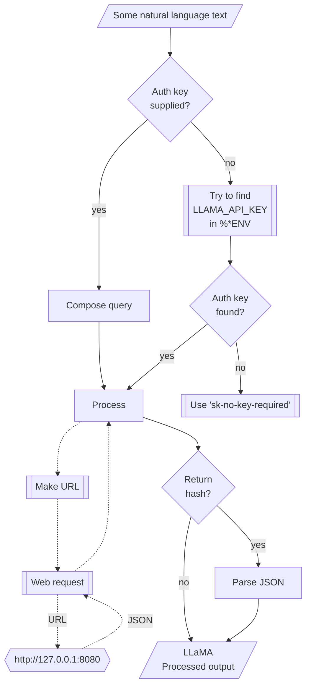

# WWW::LLaMA

## In brief

This Raku package provides access to the machine learning service [llamafile](https://github.com/mozilla-Ocho/llamafile), [MO1].
For more details of the llamafile's API usage see [the documentation](https://github.com/mozilla-Ocho/llamafile?tab=readme-ov-file), [MO2].

This package is very similar to the packages 
["WWW::OpenAI"](https://github.com/antononcube/Raku-WWW-OpenAI), [AAp1], and 
["WWW::MistralAI"](https://github.com/antononcube/Raku-WWW-MistralAI), [AAp2]. 

"WWW::LLaMA" can be used with (is integrated with) 
["LLM::Functions"](https://github.com/antononcube/Raku-LLM-Functions), [AAp3], and
["Jupyter::Chatbook"](https://github.com/antononcube/Raku-Jupyter-Chatbook), [AAp5].

Also, of course, prompts from 
["LLM::Prompts"](https://github.com/antononcube/Raku-LLM-Prompts), [AAp4],
can be used with LLaMA's functions.

**Remark:** The package "WWW::OpenAI" can be also used to access 
["llamafile" chat completions](https://github.com/Mozilla-Ocho/llamafile/blob/main/llama.cpp/server/README.md#api-endpoints).
That is done by specifying appropriate base URL to the `openai-chat-completion` function.

-----

## Installation

Package installations from both sources use [zef installer](https://github.com/ugexe/zef)
(which should be bundled with the "standard" Rakudo installation file.)

To install the package from [Zef ecosystem](https://raku.land/) use the shell command:

```
zef install WWW::LLaMA
```

To install the package from the GitHub repository use the shell command:

```
zef install https://github.com/antononcube/Raku-WWW-LLaMA.git
```

----

## Install and run LLaMA server

In order to use the package access to LLaMA server is required.

Since the package follows closely the Web API of ["llamafile"](https://github.com/Mozilla-Ocho/llamafile/), [MO1],
it is advised to follow first the installation steps in the section of ["Quickstart"](https://github.com/Mozilla-Ocho/llamafile/tree/main#quickstart)
of [MO1] before trying the functions of the package.

----

## Usage examples

**Remark:** When the authorization key, `auth-key`, is specified to be `Whatever`
then it is assigned the string `sk-no-key-required`.
If an authorization key is required then the env variable `LLAMA_API_KEY` can be also used.

### Universal "front-end"

The package has an universal "front-end" function `llama-playground` for the 
[different functionalities provided by llamafile](https://github.com/Mozilla-Ocho/llamafile/blob/main/README.md).

Here is a simple call for a "chat completion":

```perl6
use WWW::LLaMA;
llama-playground('What is the speed of a rocket leaving Earth?');
```
```
# {content => 
# , and how does it change as the rocket's altitude increases?, generation_settings => {frequency_penalty => 0, grammar => , ignore_eos => False, logit_bias => [], min_p => 0.05000000074505806, mirostat => 0, mirostat_eta => 0.10000000149011612, mirostat_tau => 5, model => llava-v1.5-7b-Q4_K.gguf, n_ctx => 1365, n_keep => 0, n_predict => -1, n_probs => 0, penalize_nl => True, penalty_prompt_tokens => [], presence_penalty => 0, repeat_last_n => 64, repeat_penalty => 1.100000023841858, seed => 4294967295, stop => [], stream => False, temperature => 0.800000011920929, tfs_z => 1, top_k => 40, top_p => 0.949999988079071, typical_p => 1, use_penalty_prompt_tokens => False}, model => llava-v1.5-7b-Q4_K.gguf, prompt => What is the speed of a rocket leaving Earth?, slot_id => 0, stop => True, stopped_eos => True, stopped_limit => False, stopped_word => False, stopping_word => , timings => {predicted_ms => 340.544, predicted_n => 18, predicted_per_second => 52.8566059011464, predicted_per_token_ms => 18.91911111111111, prompt_ms => 94.65, prompt_n => 12, prompt_per_second => 126.78288431061804, prompt_per_token_ms => 7.8875}, tokens_cached => 29, tokens_evaluated => 12, tokens_predicted => 18, truncated => False}
```

Another one using Bulgarian:

```perl6
llama-playground('Колко групи могат да се намерят в този облак от точки.', max-tokens => 300, random-seed => 234232, format => 'values');
```
```
# Например, група от 50 звезди може да се намери в този облак от 100 000 звезди, които са разпределени на различни места. За да се намерят всичките, е необходимо да се използва алгоритъм за търсене на най-близките съседи на всеки от обектите.
# 
# Въпреки че теоретично това може да бъде постигнато, реално това е много трудно и сложно, особено когато се има предвид голям брой звезди в облака.
```

**Remark:** The functions `llama-chat-completion` or `llama-completion` can be used instead in the examples above.
(The latter is synonym of the former.)


### Models

The current LLaMA model can be found with the function `llama-model`:

```perl6
llama-model;
```
```
# llava-v1.5-7b-Q4_K.gguf
```

**Remark:** Since there is no dedicated API endpoint for getting the model(s),
the current model is obtained via "simple" (non-chat) completion.

### Code generation

There are two types of completions : text and chat. Let us illustrate the differences
of their usage by Raku code generation. Here is a text completion:

```perl6
llama-completion(
        'generate Raku code for making a loop over a list',
        max-tokens => 120,
        format => 'values');
```
```
# Here's an example of Raku code for making a loop over a list:
# ```
# my @numbers = (1, 2, 3, 4, 5);
# 
# for @numbers -> $number {
#     say "The number is $number.";
# }
# ```
# This will print the numbers in the list, one by one. The `->` operator is used to bind the value of each element in the list to a variable, and the `{}` block is used to define the code that should be executed for each iteration of the loop.
```

Here is a chat completion:

```perl6
llama-completion(
        'generate Raku code for making a loop over a list',
        max-tokens => 120,
        format => 'values');
```
```
# Here's an example of a loop over a list in Raku:
# ```perl
# my @list = (1, 2, 3, 4, 5);
# 
# for @list -> $item {
#     say "The value of $item is $item.";
# }
# ```
# This will output:
# ```sql
# The value of 1 is 1.
# The value of 2 is 2.
# The value of 3 is 3.
# The value of 4 is 4.
# The value of 5
```


### Embeddings

Embeddings can be obtained with the function `llama-embedding`. Here is an example of finding the embedding vectors
for each of the elements of an array of strings:

```perl6
my @queries = [
    'make a classifier with the method RandomForeset over the data dfTitanic',
    'show precision and accuracy',
    'plot True Positive Rate vs Positive Predictive Value',
    'what is a good meat and potatoes recipe'
];

my $embs = llama-embedding(@queries, format => 'values', method => 'tiny');
$embs.elems;
```
```
# 4
```

Here we show:
- That the result is an array of four vectors each with length 1536
- The distributions of the values of each vector

```perl6
use Data::Reshapers;
use Data::Summarizers;

say "\$embs.elems : { $embs.elems }";
say "\$embs>>.elems : { $embs>>.elems }";
records-summary($embs.kv.Hash.&transpose);
```
```
# $embs.elems : 4
# $embs>>.elems : 4096 4096 4096 4096
# +--------------------------------+----------------------------------+---------------------------------+-----------------------------------+
# | 1                              | 2                                | 0                               | 3                                 |
# +--------------------------------+----------------------------------+---------------------------------+-----------------------------------+
# | Min    => -30.241486           | Min    => -20.993749618530273    | Min    => -32.435486            | Min    => -31.10381317138672      |
# | 1st-Qu => -0.7924895882606506  | 1st-Qu => -1.0563270449638367    | 1st-Qu => -0.9738395810127258   | 1st-Qu => -0.9602127969264984     |
# | Mean   => 0.001538657780784547 | Mean   => -0.013997373717373307  | Mean   => 0.0013605252470370028 | Mean   => -0.03597712098735428    |
# | Median => 0.016784800216555596 | Median => -0.0001810337998904288 | Median => 0.023735892958939075  | Median => -0.00221119043999351575 |
# | 3rd-Qu => 0.77385222911834715  | 3rd-Qu => 0.9824191629886627     | 3rd-Qu => 0.9983229339122772    | 3rd-Qu => 0.9385882616043091      |
# | Max    => 25.732345581054688   | Max    => 23.233409881591797     | Max    => 15.80211067199707     | Max    => 24.811737               |
# +--------------------------------+----------------------------------+---------------------------------+-----------------------------------+
```

Here we find the corresponding dot products and (cross-)tabulate them:

```perl6
use Data::Reshapers;
use Data::Summarizers;
my @ct = (^$embs.elems X ^$embs.elems).map({ %( i => $_[0], j => $_[1], dot => sum($embs[$_[0]] >>*<< $embs[$_[1]])) }).Array;

say to-pretty-table(cross-tabulate(@ct, 'i', 'j', 'dot'), field-names => (^$embs.elems)>>.Str);
```
```
# +---+--------------+--------------+--------------+--------------+
# |   |      0       |      1       |      2       |      3       |
# +---+--------------+--------------+--------------+--------------+
# | 0 | 14984.053717 | 1708.345468  | 4001.487938  | 7619.791201  |
# | 1 | 1708.345468  | 10992.176167 | -1364.137315 | -2970.554539 |
# | 2 | 4001.487938  | -1364.137315 | 14473.816914 | 6428.638382  |
# | 3 | 7619.791201  | -2970.554539 | 6428.638382  | 14534.609050 |
# +---+--------------+--------------+--------------+--------------+
````

**Remark:** Note that the fourth element (the cooking recipe request) is an outlier.
(Judging by the table with dot products.)

### Tokenizing and de-tokenizing

Here we tokenize some text:

```perl6
my $txt = @queries.head;
my $res = llama-tokenize($txt, format => 'values');
```
```
# [1207 263 770 3709 411 278 1158 16968 29943 2361 300 975 278 848 4489 29911 8929 293]
```

Here we get the original text be de-tokenizing:

```perl6
llama-detokenize($res);
```
```
# {content =>  make a classifier with the method RandomForeset over the data dfTitanic}
```

### Chat completions with engineered prompts

Here is a prompt for "emojification" (see the
[Wolfram Prompt Repository](https://resources.wolframcloud.com/PromptRepository/)
entry
["Emojify"](https://resources.wolframcloud.com/PromptRepository/resources/Emojify/)):

```perl6
my $preEmojify = q:to/END/;
Rewrite the following text and convert some of it into emojis.
The emojis are all related to whatever is in the text.
Keep a lot of the text, but convert key words into emojis.
Do not modify the text except to add emoji.
Respond only with the modified text, do not include any summary or explanation.
Do not respond with only emoji, most of the text should remain as normal words.
END
```
```
# Rewrite the following text and convert some of it into emojis.
# The emojis are all related to whatever is in the text.
# Keep a lot of the text, but convert key words into emojis.
# Do not modify the text except to add emoji.
# Respond only with the modified text, do not include any summary or explanation.
# Do not respond with only emoji, most of the text should remain as normal words.
```

Here is an example of chat completion with emojification:

```perl6
llama-chat-completion([ system => $preEmojify, user => 'Python sucks, Raku rocks, and Perl is annoying'], max-tokens => 200, format => 'values')
```
```
# 🐍💥
```

-------

## Command Line Interface

### Playground access

The package provides a Command Line Interface (CLI) script:

```shell
llama-playground --help
```
```
# Usage:
#   llama-playground [<words> ...] [--path=<Str>] [--mt|--max-tokens[=Int]] [-m|--model=<Str>] [-r|--role=<Str>] [-t|--temperature[=Real]] [--response-format=<Str>] [-a|--auth-key=<Str>] [--timeout[=UInt]] [-f|--format=<Str>] [--method=<Str>] [--base-url=<Str>] -- Command given as a sequence of words.
#   
#     --path=<Str>               Path, one of ''completions', 'chat/completions', 'embeddings', or 'models'. [default: 'chat/completions']
#     --mt|--max-tokens[=Int]    The maximum number of tokens to generate in the completion. [default: 2048]
#     -m|--model=<Str>           Model. [default: 'Whatever']
#     -r|--role=<Str>            Role. [default: 'user']
#     -t|--temperature[=Real]    Temperature. [default: 0.7]
#     --response-format=<Str>    The format in which the response is returned. [default: 'url']
#     -a|--auth-key=<Str>        Authorization key (to use LLaMA server Web API.) [default: 'Whatever']
#     --timeout[=UInt]           Timeout. [default: 10]
#     -f|--format=<Str>          Format of the result; one of "json", "hash", "values", or "Whatever". [default: 'Whatever']
#     --method=<Str>             Method for the HTTP POST query; one of "tiny" or "curl". [default: 'tiny']
#     --base-url=<Str>           Base URL of the LLaMA server. [default: 'http://127.0.0.1:80…']
```

**Remark:** When the authorization key, `auth-key`, is specified to be `Whatever`
then it is assigned the string `sk-no-key-required`.
If an authorization key is required then the env variable `LLAMA_API_KEY` can be also used.

--------

## Mermaid diagram

The following flowchart corresponds to the steps in the package function `llama-playground`:



--------

## References

### Packages

[AAp1] Anton Antonov,
[WWW::OpenAI Raku package](https://github.com/antononcube/Raku-WWW-OpenAI),
(2023-2024),
[GitHub/antononcube](https://github.com/antononcube).

[AAp2] Anton Antonov,
[WWW::MistralAI Raku package](https://github.com/antononcube/Raku-WWW-MistralAI),
(2023-2024),
[GitHub/antononcube](https://github.com/antononcube).

[AAp3] Anton Antonov,
[LLM::Functions Raku package](https://github.com/antononcube/Raku-LLM-Functions),
(2023-2024),
[GitHub/antononcube](https://github.com/antononcube).

[AAp4] Anton Antonov,
[LLM::Prompts Raku package](https://github.com/antononcube/Raku-LLM-Prompts),
(2023-2024),
[GitHub/antononcube](https://github.com/antononcube).

[AAp5] Anton Antonov,
[Jupyter::Chatbook Raku package](https://github.com/antononcube/Raku-Jupyter-Chatbook),
(2023),
[GitHub/antononcube](https://github.com/antononcube).

[MO1] Mozilla Ocho, [llamafile](https://github.com/mozilla-Ocho/llamafile).

[MO2] Mozilla Ocho, [llamafile documentation](https://github.com/Mozilla-Ocho/llamafile/blob/main/README.md).
