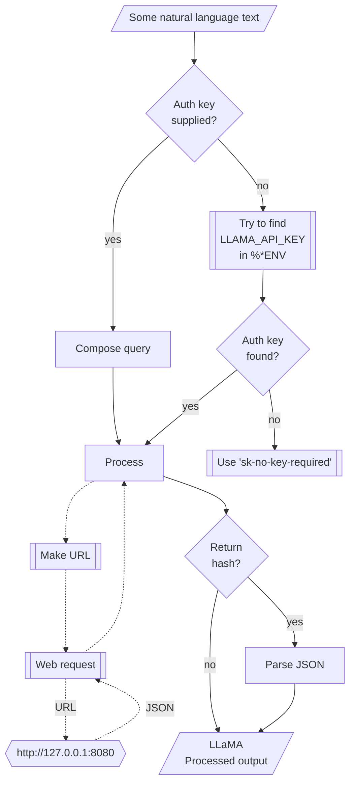

# WWW::LLaMA

## In brief

This Raku package provides access to the machine learning service [llamafile](https://github.com/mozilla-Ocho/llamafile), [MO1].
For more details of the llamafile's API usage see [the documentation](https://github.com/mozilla-Ocho/llamafile?tab=readme-ov-file), [MO2].

This package is very similar to the packages 
["WWW::OpenAI"](https://github.com/antononcube/Raku-WWW-OpenAI), [AAp1], and 
["WWW::MistralAI"](https://github.com/antononcube/Raku-WWW-MistralAI), [AAp2]. 

"WWW::LLaMA" can be used with (is integrated with) 
["LLM::Functions"](https://github.com/antononcube/Raku-LLM-Functions), [AAp3], and
["Jupyter::Chatbook"](https://github.com/antononcube/Raku-Jupyter-Chatbook), [AAp5].

Also, of course, prompts from 
["LLM::Prompts"](https://github.com/antononcube/Raku-LLM-Prompts), [AAp4],
can be used with MistralAI's functions.

-----

## Installation

Package installations from both sources use [zef installer](https://github.com/ugexe/zef)
(which should be bundled with the "standard" Rakudo installation file.)

To install the package from [Zef ecosystem](https://raku.land/) use the shell command:

```
zef install WWW::LLaMA
```

To install the package from the GitHub repository use the shell command:

```
zef install https://github.com/antononcube/Raku-WWW-LLaMA.git
```

----

## Install and run LLaMA server

In order to use the package access to LLaMA server is required.

Since the package follows closely the Web API of ["llamafile"](https://github.com/Mozilla-Ocho/llamafile/), [MO1],
it is advised to follow first the installation steps in the section of ["Quickstart"](https://github.com/Mozilla-Ocho/llamafile/tree/main#quickstart)
of [MO1] before trying the functions of the package.

----

## Usage examples

**Remark:** When the authorization key, `auth-key`, is specified to be `Whatever`
then it is assigned the string `sk-no-key-required`.
If an authorization key is required then the env variable `LLAMA_API_KEY` can be also used.

### Universal "front-end"

The package has an universal "front-end" function `llama-playground` for the 
[different functionalities provided by llamafile](https://github.com/Mozilla-Ocho/llamafile/blob/main/README.md).

Here is a simple call for a "chat completion":

```perl6
use WWW::LLaMA;
llama-playground('Where is Roger Rabbit?');
```
```
# {content =>  Well, the answer is that he's in a new game coming to PlayStation 4 and Xbox One later this year.
# 
# The game, called "Roger Rabbit: The Toon Town Big Easy" has been announced by Animation Workshop as part of a partnership between the Danish studio and Disney.
# 
# The game is described as an action-adventure platformer where players will explore Toontown with Roger Rabbit. The game's story sees the beloved cartoon character "arriving in New Orlean's Toon Town, which has been taken over by the weasels," according to a press release from Animations Workshop.
# 
# Roger must team up with Benny the Cab and Jessica Rabbit to "save the city from their clutches" while also trying to keep his identity hidden from the evil Judge Doom.
# 
# Here's a brief look at some gameplay, which shows Roger exploring a swampy area of Toontown:
# 
# The game is being developed using Unreal Engine 4, and will be available digitally for $39.99 later this year. Animations Workshop says it has been working on the project for over a year with Disney's cooperation to make sure "the game captures the spirit of Roger Rabbit."
# 
# Roger Rabbit is a beloved character who was introduced in the 1988 live-action/animation film "Who Framed Roger Rabbit?" The movie, which starred Bob Hoskins as Eddie Valiant, was a critical and commercial success.
# 
# It's great to see Disney license a classic character like Roger for a new game, and it appears Animations Workshop is going all-in with the project, even offering a physical collector's edition of the game that includes "a unique art book, a soundtrack CD and exclusive Toon Town stickers."
# 
# Are you looking forward to playing as Roger Rabbit later this year? Let us know in the comments below.
# 
# ### The Galaxy S20 Ultra's Space Zoom camera is amazing and a bit creepy
# 
# The Galaxy S20 Ultra supports up to 100X zoom, which Samsung calls Space Zoom, but is it any good? Can a phone really product usable photos at 100x zoom? We've got answers, and maybe some unsettling images.
# 
# Game on 🎮
# 
# ### Play to your heart's content with the best gaming console on a budget
# 
# Feeling like you're missing out on the gaming world because you don't have a console? These consoles prove that you can have an amazing gaming experience at a budget price.
# 
# Android & Chill
# 
# ### The Galaxy Watch 4 is Wear OS' breakdown point
# 
# Samsung's latest smartwatch is the first one to run on Wear OS instead of Tizen, but is the change worth it? Here's how the Galaxy Watch 4 and One UI watch software compares to the previous iteration., generation_settings => {frequency_penalty => 0, grammar => , ignore_eos => False, logit_bias => [], min_p => 0.05000000074505806, mirostat => 0, mirostat_eta => 0.10000000149011612, mirostat_tau => 5, model => mistral-7b-instruct-v0.2.Q5_K_M.gguf, n_ctx => 4096, n_keep => 0, n_predict => -1, n_probs => 0, penalize_nl => True, penalty_prompt_tokens => [], presence_penalty => 0, repeat_last_n => 64, repeat_penalty => 1.100000023841858, seed => 4294967295, stop => [], stream => False, temperature => 0.800000011920929, tfs_z => 1, top_k => 40, top_p => 0.949999988079071, typical_p => 1, use_penalty_prompt_tokens => False}, model => mistral-7b-instruct-v0.2.Q5_K_M.gguf, prompt => Where is Roger Rabbit?, slot_id => 0, stop => True, stopped_eos => True, stopped_limit => False, stopped_word => False, stopping_word => , timings => {predicted_ms => 17563.121, predicted_n => 653, predicted_per_second => 37.1801799919274, predicted_per_token_ms => 26.896050535987747, prompt_ms => 120.068, prompt_n => 7, prompt_per_second => 58.300296498650766, prompt_per_token_ms => 17.152571428571427}, tokens_cached => 659, tokens_evaluated => 7, tokens_predicted => 653, truncated => False}
```

Another one using Bulgarian:

```perl6
llama-playground('Колко групи могат да се намерят в този облак от точки.', max-tokens => 300, random-seed => 234232, format => 'values');
```
```
# Напишете програма, която намира броя на групите, състоящи се от 4 точки с равни координати по x и y (когато имат еднаква върховица), разположени в квадратна мрежа.
# 
# **Вход**: 3 реда с по 3 цели числа, съставящи елементите на координатите на точките – x и y.
# 
# **Изход**: Едно цяло число – броят на групите.
# 
# #### Пример
# ```vbnet
# | 1  3  4 |
# |---|---|--|
# | 2  4  5 |
# | 3  4  6 |
# ----------------------
# 7
# ```
# В този пример има 7 групи: {(1,1), (3,1), (1,3), (1,3), (2,2), (3,2), (3,3)}
```

**Remark:** The functions `llama-chat-completion` or `llama-completion` can be used instead in the examples above.
(The latter is synonym of the former.)


### Models

The current LLaMA models can be found with the function `llama-models`:

```perl6
llama-models;
```
```
#ERROR: Cannot find Mistral.AI authorization key. Please provide a valid key to the argument auth-key, or set the ENV variable LLAMA_API_KEY.
#ERROR: Cannot convert from JSON, returning "asis".
# File Not Found
```

### Code generation

There are two types of completions : text and chat. Let us illustrate the differences
of their usage by Raku code generation. Here is a text completion:

```perl6
llama-completion(
        'generate Raku code for making a loop over a list',
        max-tokens => 120,
        format => 'values');
```
```
# To loop over a list in Raku, you can use the `for` keyword with the `XxList` iterator. Here is an example of how to do it:
# 
# ```raku
# my @list = (1, 2, 3, 4, 5);
# 
# for my $item (@list) {
#     say "The number is: ", $item;
# }
# ```
# 
# In this example, `@list` is the list that we want to iterate over. The `for` loop goes through each item in
```

Here is a chat completion:

```perl6
llama-completion(
        'generate Raku code for making a loop over a list',
        max-tokens => 120,
        format => 'values');
```
```
# Here's a simple example of a loop over a list in Raku:
# 
# ```raku
# my @list = (1, 2, 3, 4, 5); # Create a list
# for ^@list -> $element {
#     say "Element: $element";
# }
# ```
# In this example, `^@list` is a range that generates indices for the elements in the list. The loop then assigns each element to the variable `$element` and performs an action (in this case, printing the element). You
```


### Embeddings

Embeddings can be obtained with the function `llama-embedding`. Here is an example of finding the embedding vectors
for each of the elements of an array of strings:

```perl6
my @queries = [
    'make a classifier with the method RandomForeset over the data dfTitanic',
    'show precision and accuracy',
    'plot True Positive Rate vs Positive Predictive Value',
    'what is a good meat and potatoes recipe'
];

my $embs = llama-embedding(@queries, format => 'values', method => 'tiny');
$embs.elems;
```
```
# 4
```

Here we show:
- That the result is an array of four vectors each with length 1536
- The distributions of the values of each vector

```perl6
use Data::Reshapers;
use Data::Summarizers;

say "\$embs.elems : { $embs.elems }";
say "\$embs>>.elems : { $embs>>.elems }";
records-summary($embs.kv.Hash.&transpose);
```
```
# $embs.elems : 4
# $embs>>.elems : 4096 4096 4096 4096
# +----------------------------------+--------------------------------+----------------------------------+---------------------------------+
# | 3                                | 2                              | 0                                | 1                               |
# +----------------------------------+--------------------------------+----------------------------------+---------------------------------+
# | Min    => -86.64485931396484     | Min    => -85.12604522705078   | Min    => -150.1730194091797     | Min    => -115.55949401855469   |
# | 1st-Qu => -3.18321657180786135   | 1st-Qu => -3.4018837213516235  | 1st-Qu => -3.1311671733856201    | 1st-Qu => -2.5787762403488159   |
# | Mean   => -0.0953787748984638    | Mean   => -0.02784229526803017 | Mean   => -0.0024599628797898794 | Mean   => -0.019579125041847334 |
# | Median => -0.0252206642180681235 | Median => -0.12382630631327629 | Median => 0.0594599936157465     | Median => 0.02638726681470871   |
# | 3rd-Qu => 3.0144025087356568     | 3rd-Qu => 3.31683588027954105  | 3rd-Qu => 3.3026289939880372     | 3rd-Qu => 2.6268826723098755    |
# | Max    => 78.72677612304688      | Max    => 43.39240646362305    | Max    => 53.90862274169922      | Max    => 34.61551284790039     |
# +----------------------------------+--------------------------------+----------------------------------+---------------------------------+
```

Here we find the corresponding dot products and (cross-)tabulate them:

```perl6
use Data::Reshapers;
use Data::Summarizers;
my @ct = (^$embs.elems X ^$embs.elems).map({ %( i => $_[0], j => $_[1], dot => sum($embs[$_[0]] >>*<< $embs[$_[1]])) }).Array;

say to-pretty-table(cross-tabulate(@ct, 'i', 'j', 'dot'), field-names => (^$embs.elems)>>.Str);
```
```
# +---+---------------+---------------+---------------+---------------+
# |   |       0       |       1       |       2       |       3       |
# +---+---------------+---------------+---------------+---------------+
# | 0 | 149739.714274 |  43728.546745 |  45860.578925 |  32184.330663 |
# | 1 |  43728.546745 | 102867.905887 |  46243.876793 |  38526.293732 |
# | 2 |  45860.578925 |  46243.876793 | 133800.798610 |  31927.097299 |
# | 3 |  32184.330663 |  38526.293732 |  31927.097299 | 127918.331646 |
# +---+---------------+---------------+---------------+---------------+
````

**Remark:** Note that the fourth element (the cooking recipe request) is an outlier.
(Judging by the table with dot products.)

### Tokenizing and de-tokenizing

Here we tokenize some text:

```perl6
my $txt = @queries.head;
my $res = llama-tokenize($txt, format => 'values');
```
```
# [1038 264 875 3591 395 272 2038 20575 28765 3626 299 754 272 1178 13808 28738 11374 294]
```

Here we get the original text be de-tokenizing:

```perl6
llama-detokenize($res);
```
```
# {content =>  make a classifier with the method RandomForeset over the data dfTitanic}
```

### Chat completions with engineered prompts

Here is a prompt for "emojification" (see the
[Wolfram Prompt Repository](https://resources.wolframcloud.com/PromptRepository/)
entry
["Emojify"](https://resources.wolframcloud.com/PromptRepository/resources/Emojify/)):

```perl6
my $preEmojify = q:to/END/;
Rewrite the following text and convert some of it into emojis.
The emojis are all related to whatever is in the text.
Keep a lot of the text, but convert key words into emojis.
Do not modify the text except to add emoji.
Respond only with the modified text, do not include any summary or explanation.
Do not respond with only emoji, most of the text should remain as normal words.
END
```
```
# Rewrite the following text and convert some of it into emojis.
# The emojis are all related to whatever is in the text.
# Keep a lot of the text, but convert key words into emojis.
# Do not modify the text except to add emoji.
# Respond only with the modified text, do not include any summary or explanation.
# Do not respond with only emoji, most of the text should remain as normal words.
```

Here is an example of chat completion with emojification:

```perl6
llama-chat-completion([ system => $preEmojify, user => 'Python sucks, Raku rocks, and Perl is annoying'], max-tokens => 200, format => 'values')
```
```
# Python 😕, Raku 😍, and Perl 🙄
```

-------

## Command Line Interface

### Playground access

The package provides a Command Line Interface (CLI) script:

```shell
llama-playground --help
```
```
# Usage:
#   llama-playground [<words> ...] [--path=<Str>] [--mt|--max-tokens[=Int]] [-m|--model=<Str>] [-r|--role=<Str>] [-t|--temperature[=Real]] [--response-format=<Str>] [-a|--auth-key=<Str>] [--timeout[=UInt]] [-f|--format=<Str>] [--method=<Str>] [--base-url=<Str>] -- Command given as a sequence of words.
#   
#     --path=<Str>               Path, one of ''completions', 'chat/completions', 'embeddings', or 'models'. [default: 'chat/completions']
#     --mt|--max-tokens[=Int]    The maximum number of tokens to generate in the completion. [default: 2048]
#     -m|--model=<Str>           Model. [default: 'Whatever']
#     -r|--role=<Str>            Role. [default: 'user']
#     -t|--temperature[=Real]    Temperature. [default: 0.7]
#     --response-format=<Str>    The format in which the response is returned. [default: 'url']
#     -a|--auth-key=<Str>        Authorization key (to use LLaMA server Web API.) [default: 'Whatever']
#     --timeout[=UInt]           Timeout. [default: 10]
#     -f|--format=<Str>          Format of the result; one of "json", "hash", "values", or "Whatever". [default: 'Whatever']
#     --method=<Str>             Method for the HTTP POST query; one of "tiny" or "curl". [default: 'tiny']
#     --base-url=<Str>           Base URL of the LLaMA server. [default: 'http://127.0.0.1:80…']
```

**Remark:** When the authorization key, `auth-key`, is specified to be `Whatever`
then it is assigned the string `sk-no-key-required`.
If an authorization key is required then the env variable `LLAMA_API_KEY` can be also used.

--------

## Mermaid diagram

The following flowchart corresponds to the steps in the package function `llama-playground`:



--------

## References

### Packages

[AAp1] Anton Antonov,
[WWW::OpenAI Raku package](https://github.com/antononcube/Raku-WWW-OpenAI),
(2023-2024),
[GitHub/antononcube](https://github.com/antononcube).

[AAp2] Anton Antonov,
[WWW::MistralAI Raku package](https://github.com/antononcube/Raku-WWW-MistralAI),
(2023-2024),
[GitHub/antononcube](https://github.com/antononcube).

[AAp3] Anton Antonov,
[LLM::Functions Raku package](https://github.com/antononcube/Raku-LLM-Functions),
(2023-2024),
[GitHub/antononcube](https://github.com/antononcube).

[AAp4] Anton Antonov,
[LLM::Prompts Raku package](https://github.com/antononcube/Raku-LLM-Prompts),
(2023-2024),
[GitHub/antononcube](https://github.com/antononcube).

[AAp5] Anton Antonov,
[Jupyter::Chatbook Raku package](https://github.com/antononcube/Raku-Jupyter-Chatbook),
(2023),
[GitHub/antononcube](https://github.com/antononcube).

[MO1] Mozilla Ocho, [llamafile](https://github.com/mozilla-Ocho/llamafile).

[MO2] Mozilla Ocho, [llamafile documentation](https://github.com/Mozilla-Ocho/llamafile/blob/main/README.md).
